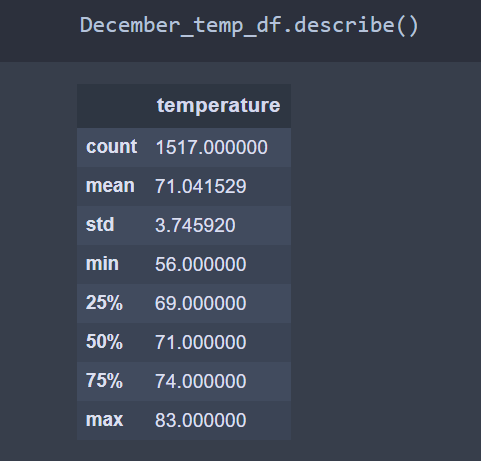
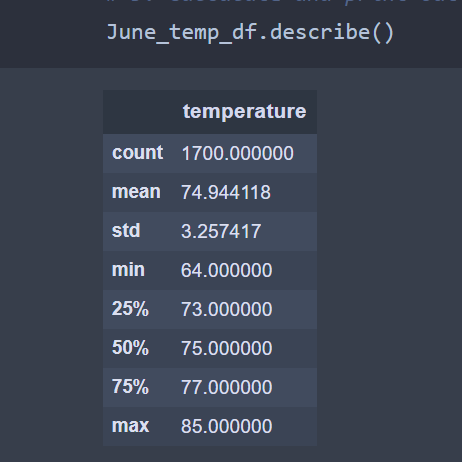

# Surfs_Up

## Introduction 

In this analysis we are trying to establish a Surf and Shake shop in Oahu in Hawaii. We are using our savings, but also need some investor backing to set up in Surf and Shake shop. After putting on a strong business plan, we reach out to a investor A. Wavy. Due to weather concerns, our investor wants us to analyze the weather data from a weather dataset of the Island of Oahu, in order to analyze the Oahu weather to understand the feasibility of a shake the surf shop. 

## Challange Report 

### Overview 

We are asked to analyze weather trends in the month of June and December to understand whether our surf shop is sustainable all year around. To do this we leveraged Python and Jupyter Notebooks to create our weather analysis. We will present our results and explain what they mean for the business.

### Results 
* In June, we have a mean temperature of 74.9 degrees, a minimum of 64, maximum of 85, and a median of 75
* In December we have a mean temperature of 71 degrees, a minimum of 56,maximum of 83 and a median of 71
* Ideal temperature for surfing is around the 70s, June temperature will be best for surfing while December temperature will also work pretty well, surf and shake shop will be sustainable all year round 

### Summary 

