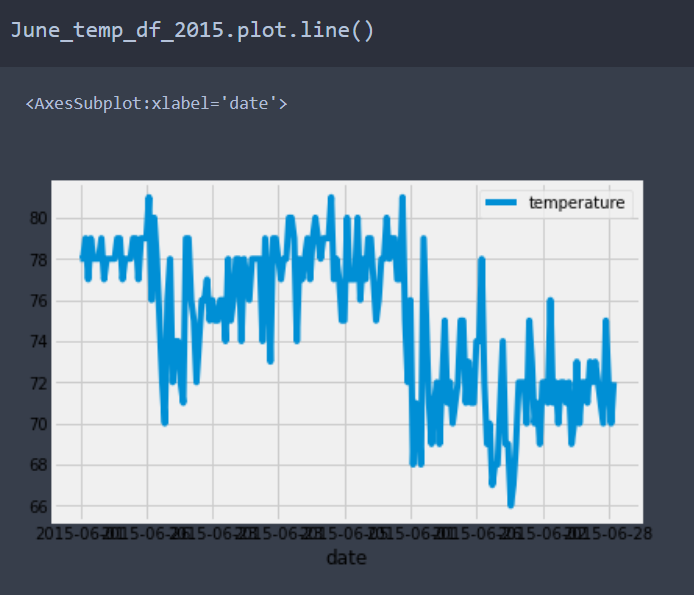
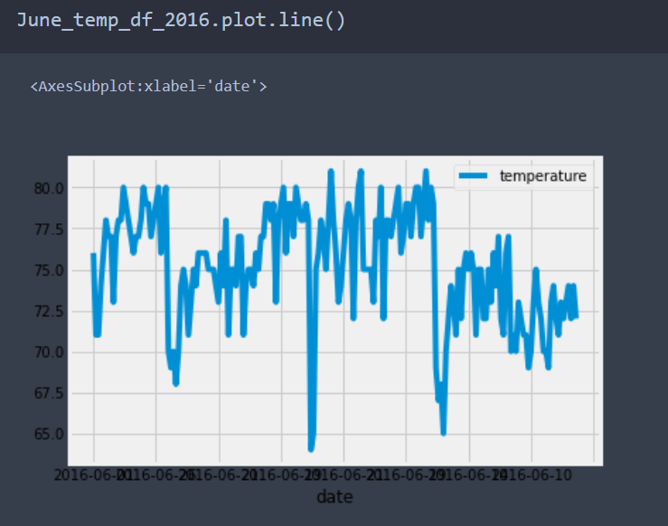
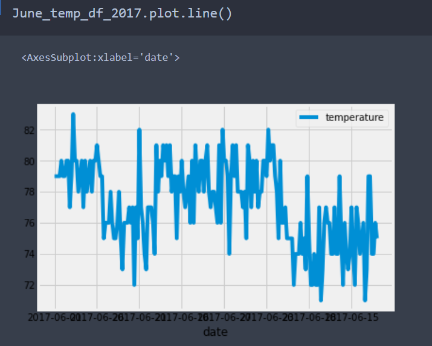
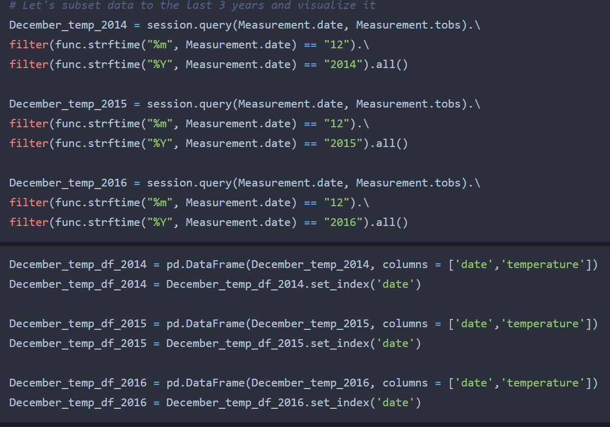
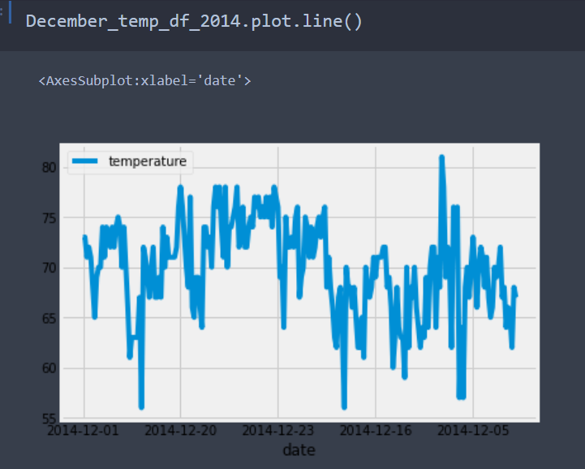
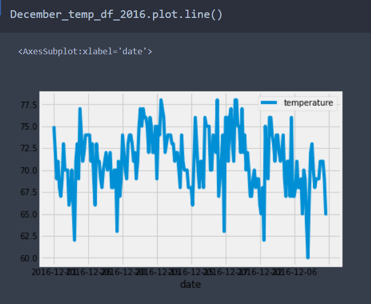

# Surfs_Up

## Introduction 

In this analysis we are trying to establish a Surf and Shake shop in Oahu in Hawaii. We are using our savings, but also need some investor backing to set up in Surf and Shake shop. After putting on a strong business plan, we reach out to a investor A. Wavy. Due to weather concerns, our investor wants us to analyze the weather data from a weather dataset of the Island of Oahu, in order to analyze the Oahu weather to understand the feasibility of a shake the surf shop. 

## Challange Report 

### Overview 

We are asked to analyze weather trends in the month of June and December to understand whether our surf shop is sustainable all year around. To do this we leveraged Python and Jupyter Notebooks to create our weather analysis. We will present our results and explain what they mean for the business.

### Results 
* In June, we have a mean temperature of 74.9 degrees, a minimum of 64, maximum of 85, and a median of 75
* In December we have a mean temperature of 71 degrees, a minimum of 56,maximum of 83 and a median of 71
* Ideal temperature for surfing is around the 70s, June temperature will be best for surfing while December temperature will also work pretty well, surf and shake shop will be sustainable all year round 

#### June 

#### December 

### Summary 
After running descriptive statistics for weather in June and December, we find that June is a great month for surfing in Oahu, as ideal weather for surfing is when it is neither too hot or too cold (someone in the 70s), the mean and median temperature are both 74.9 and 75 in June which means there will be plenty of customers renting surf boards and buying ice cream. December temperatures are also pretty good for surfing and ice cream, the minumum of 56 is a concern but the mean and median remain around 71 which means that most days will be good for surfing. We should expect June to be busy, but looks like the business will be sustaible and will manage to operate all year long. Oahu looks like a great destination for a Surf & Shake shop. 

There are a few other queries we can run in order to better understand weather data for June and December. I noticed that weather data is yearly so I decided to filter data for the past three years to uncover weather trends specific for the past 3 years. So I ran a query get data for June  for the year 2015, 2016 and 2017, each year as a separate dataframe and created line graphs for month of June for each year. For December since we did not have 2017 data available we queried data for 2014, 2015 and 2016 and visualized this data with line graphs for the month of December for each year. 

### June Query and Graphs 

### December Query and Graphs 

